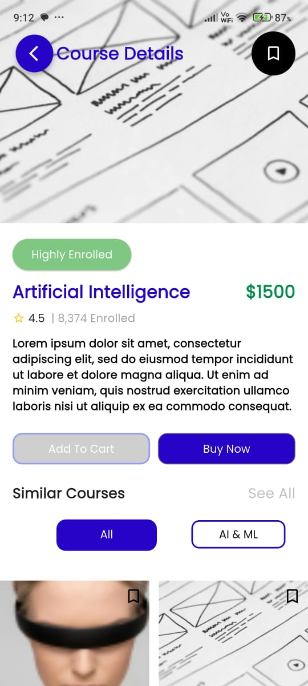

# 📱 Flutter UI Implementation – Catalift Developer Task

## Features

- **Sliver App Bar**:  
  A flexible app bar that expands, collapses, and integrates seamlessly with scrollable content.

- **Tab Bar**:  
  A widget for switching between different sections of the app using tabs.

- **Stack**:  
   Enables layered layout and floating elements, often used for complex designs.
   

  ## Screen

  

  ## Demo

  
