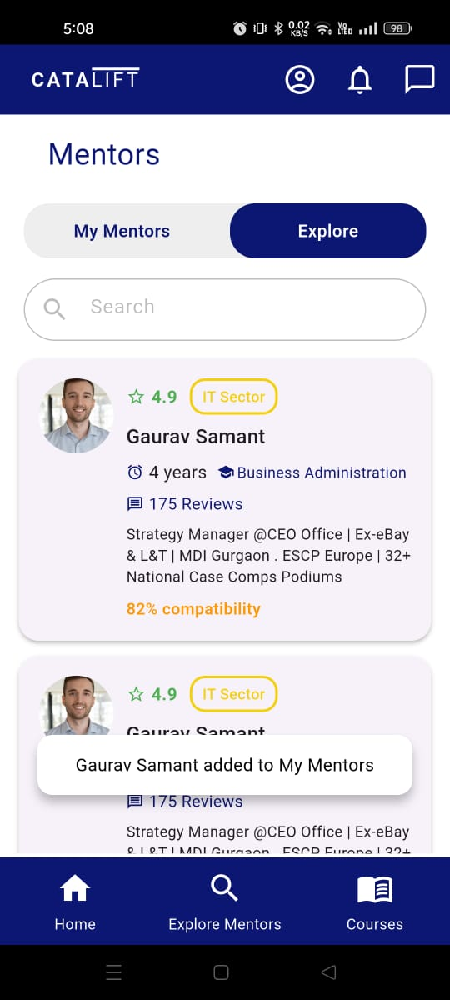
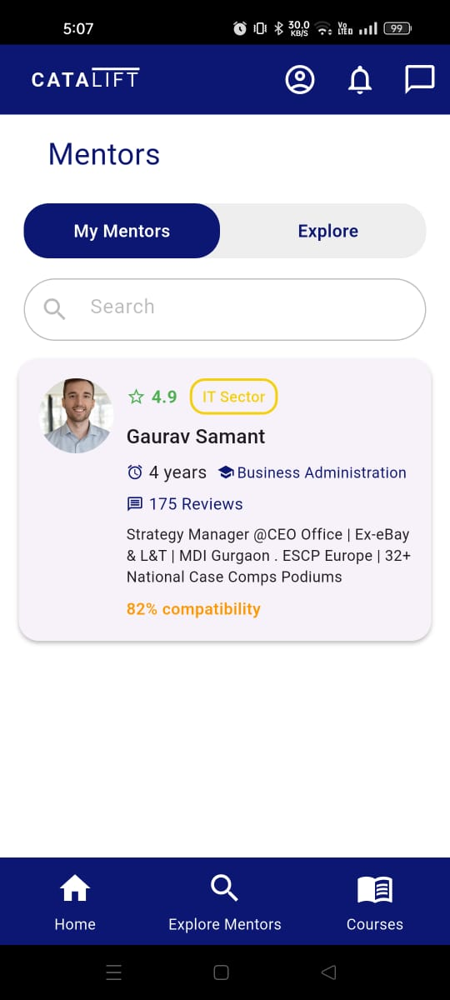
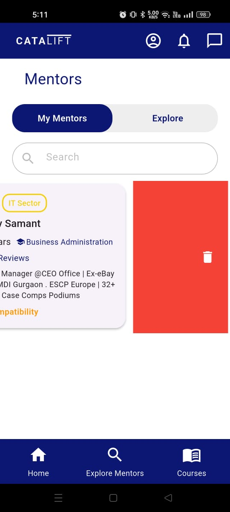

# MentorConnect UI (Flutter)

A clean and modular Flutter UI screen built as part of the **TechCatalift** task submission.

## 🚀 Features

- 📱 Modern Flutter UI with responsive layout
- 📱 Use of Provider for state management
- 🎨 Consistent color scheme and design
- 👤 Mentor cards with rating, sector, experience, and compatibility
- 🔍 Custom search bar and snackabar 
- 🔄 Tab switcher with "My Mentors" and "Explore Mentors"
- 📂 Separated widgets and constants for better structure
- 📌 Custom bottom navigation bar
- 🎨 Use of dismissible card

## 📸 Screenshots

### Explore Mentors


### Home Screen


### Explore Mentors



## 📂 Project Structure

```plaintext
lib/
├── main.dart                           # Entry point of the app
├── models/
│   └── mentor_model.dart               # Model class for Mentor data
├── screens/
│   └── mentors_screen.dart             # UI screen showing list of mentors
├── provider/
│   └── mentor_provider.dart             # UI screen showing list of mentors
├── widgets/
│   ├── mentor_card.dart                # Reusable widget to show mentor info
│   ├── bottom_nav_bar.dart             # Custom bottom navigation bar widget
│   ├── appbar_bar.dart                 # Custom app bar bar widget
│   ├── search_bar.dart                 # Custom search bar widget
│   ├── custom_snackbar.dart            # Custom snackbar widget
│   ├── list_view.dart                  # Custom list view widget
├── constants/
│   ├── app_colors.dart                 # App color palette
│   ├── app_sizes.dart                  # Padding, radius, avatar size constants
│   ├── app_text_styles.dart            # Centralized text styles


